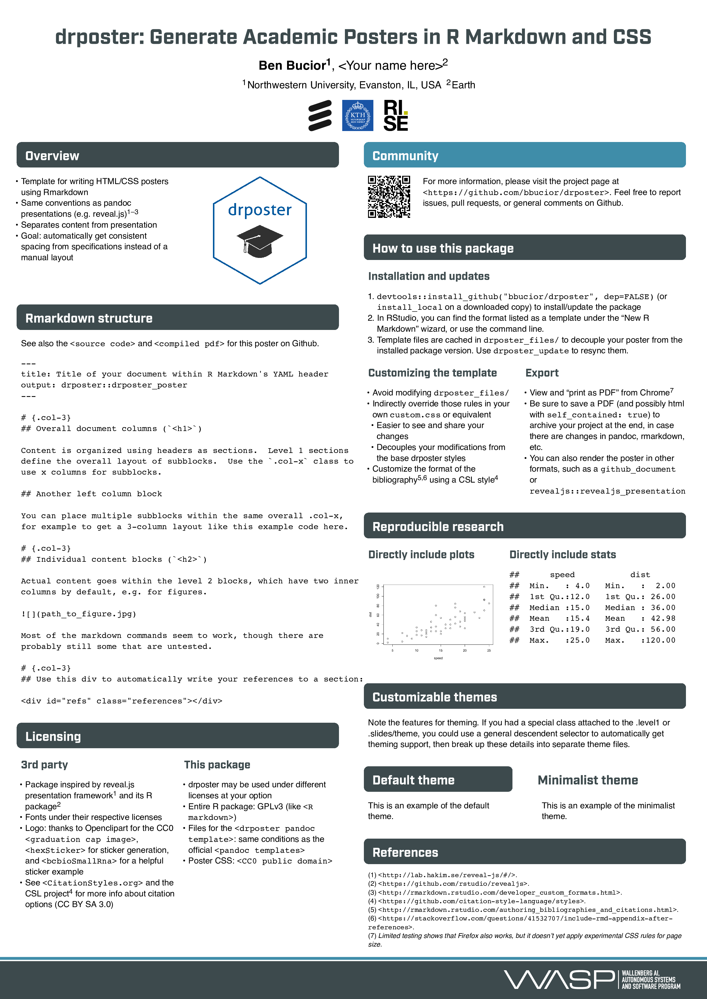

# drposter: Generate Academic Posters in R Markdown and CSS

This fork is adapted for [WASP](http://wasp-sweden.org).



## Overview

* Template for writing HTML/CSS posters using Rmarkdown
* Same conventions as pandoc presentations
  (e.g. reveal.js)
* Separates content from presentation
* Goal: automatically get consistent spacing from specifications
  instead of a manual layout

## Rmarkdown structure

See the [source
code](https://github.com/martisak/drposter/tree/master/inst/example/poster.Rmd)
and [compiled
pdf](https://github.com/martisak/drposter/tree/master/inst/example/poster.pdf)
for this poster on Github.

~~~
---
title: Title of your document within R Markdown's YAML header
output: drposter::drposter_poster
---

# {.col-3}
## Overall document columns (`<h1>`)

Content is organized using headers as sections.  Level 1 sections
define the overall layout of subblocks.  Use the `.col-x` class to
use x columns for subblocks.

## Another left column block

You can place multiple subblocks within the same overall .col-x,
for example to get a 3-column layout like this example code here.

# {.col-3}
## Individual content blocks (`<h2>`)

Actual content goes within the level 2 blocks, which have two inner
columns by default, e.g. for figures.


Most of the markdown commands seem to work, though there are
probably still some that are untested.

# {.col-3}
## Use this div to automatically write your references to a section:

<div id="refs" class="references"></div>
~~~

## Licensing

### 3rd party

* Package inspired by reveal.js presentation framework<sup>1</sup> and
  its R package
* Fonts under their respective licenses
* Logo: thanks to Openclipart for the CC0 [graduation cap
  image](https://openclipart.org/detail/244447/minimliast-graduation-hat),
  [hexSticker](https://github.com/GuangchuangYu/hexSticker) for
  sticker generation, and
  [bcbioSmallRna](https://github.com/lpantano/bcbioSmallRna/blob/master/inst/sticker/sticker.R)
  for a helpful sticker example
* See [CitationStyles.org](https://citationstyles.org/) and the CSL
  project for more info about citation options (CC BY SA
  3.0)

### This package

* drposter may be used under different licenses at your option
* Entire R package: GPLv3 (like [R
  markdown](https://github.com/rstudio/rmarkdown))
* Files for the [drposter pandoc
  template](https://github.com/bbucior/drposter/tree/master/inst/rmarkdown/templates/drposter/skeleton/drposter_files):
  same conditions as the official [pandoc
  templates](https://github.com/jgm/pandoc/tree/master/data/templates)
* Poster CSS: [CC0 public
  domain](https://creativecommons.org/publicdomain/zero/1.0/)

## Community

For more information, please visit the
project page at <https://github.com/bbucior/drposter>. Feel free to
report issues, pull requests, or general comments on Github.

## How to use this package

### Installation and updates

1.  `devtools::install_github("bbucior/drposter", dep=FALSE)` (or
    `install_local` on a downloaded copy) to install/update the package
2.  In RStudio, you can find the format listed as a template under the
    “New R Markdown” wizard, or use the command line.
3.  Template files are cached in `drposter_files/` to decouple your
    poster from the installed package version. Use `drposter_update` to
    resync them.

### Customizing the template

* Avoid modifying `drposter_files/`
* Indirectly override those rules in your own `custom.css` or
  equivalent
    * Easier to see and share your changes
    * Decouples your modifications from the base drposter styles
* Customize the format of the bibliography using a CSL
  style

### Export

* View and “print as PDF” from Chrome
  <!-- Note: the footnote used to be a bibtex "note," but the default ACS template doesn't include that field -->
* Be sure to save a PDF (and possibly html with `self_contained:
  true`) to archive your project at the end, in case there are changes
  in pandoc, rmarkdown, etc.
* You can also render the poster in other formats, such as a
  `github_document` or `revealjs::revealjs_presentation`

## Customizable themes

Note the features for theming. If you had a special class attached to
the `.level1` or `.slides/theme, you could use a general descendent
selector to automatically get theming support, then break up these
details into separate theme files.


## Pandoc

You don't need to use R if you don't want to. Instead, you can directly run `pandoc`.

```
pandoc +RTS -K512m -RTS poster.Rmd --to html4 --from markdown+autolink_bare_uris+ascii_identifiers+tex_math_single_backslash+smart --output test.html --email-obfuscation none --variable fill_page= --variable lib_dir=drposter_files/ --standalone --section-divs --template drposter_files//drposter.html --highlight-style pygments --css custom.css --mathjax -F pandoc-citeproc
```


## See also

* tikzposter latex template, and its example themes for inspiration
  <https://bitbucket.org/surmann/tikzposter/downloads/>
* [Other R markdown
  templates](https://gist.github.com/Pakillo/4854e5d760351206084f6be8abe476b2)
  with their advantages/disadvantages (pdf compatibility, consistent
  syntax with flexdashboard, etc.)